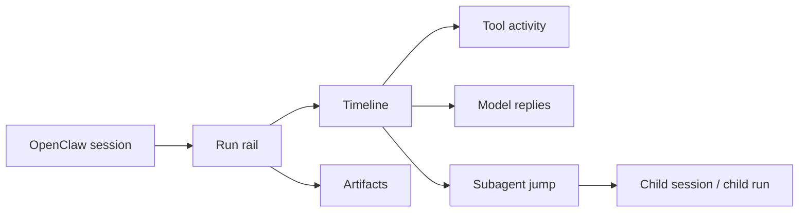

# Crew Copilot

<p align="center">
  <strong>Run-aware observability for OpenClaw</strong><br/>
  Follow sessions, runs, subagents, tool activity, timeline events, and artifacts from one dashboard.
</p>

<p align="center">
  
  
  
  
</p>

Crew Copilot turns raw agent execution into something you can actually follow. Instead of digging through scattered logs, you get a focused dashboard for understanding what ran, when it ran, which subagent it triggered, what tools fired, and what artifacts came out.

## ✨ Why It Stands Out

- 🧭 **Run-aware navigation**: inspect OpenClaw at the right level - `session -> run -> event`
- 🔗 **Subagent-aware routing**: jump from a parent agent to the exact child session and run it triggered
- 🧹 **Cleaner A2A visibility**: reduces duplicated `sessions_send` noise when richer subagent context exists
- 📡 **Live execution view**: stream updates over SSE while runs are still happening
- 💾 **Local-first history**: persist sessions and runs in SQLite so refreshes and restarts do not wipe context

## 🚀 At A Glance



## 🌟 Core Highlights

### 🧭 Run-aware navigation

Crew Copilot is built around runs, not just chat transcripts.

- Session list with run counts and live status
- Dedicated run rail for each session
- Direct path routing:
  - `/crew-copilot/session/:sessionId`
  - `/crew-copilot/session/:sessionId/run/:runId`

### 🤖 Subagent visibility that actually helps

OpenClaw agent-to-agent flows can get noisy fast. Crew Copilot makes them readable.

- Detects subagent launches from `sessions_send`
- Preserves parent -> child linkage
- Supports precise jump targets for child runs
- Hides redundant `sessions_send` timeline noise when a richer subagent event already exists

### 📜 Timeline + artifacts in one workflow

- Model prompts and replies
- Tool activity and results
- Artifact capture and final reply visibility
- Live updates while runs are still executing

### 🛡️ Safe local-first storage

- Stores data in local SQLite
- Keeps session/run history across dashboard reloads
- Marks clearly abandoned running runs as interrupted

## ⚡ Quick Start

### 1. Install dependencies

```bash
npm install
```

### 2. Build the plugin

```bash
npm run build
```

### 3. Install into OpenClaw

```bash
openclaw plugins install /path/to/crew-copilot
openclaw gateway restart
```

### 4. Open the dashboard

```text
http://127.0.0.1:18789/crew-copilot
```

Once OpenClaw starts running tasks, Crew Copilot begins capturing sessions and runs automatically.

## 👀 What You Get

### 📚 Sessions view

- Live session status
- Session labels and metadata
- Pagination for large histories

### 🏃 Runs view

- Per-session run list
- Run input preview
- Task / tool / artifact counts

### 🔍 Detail view

- Timeline of execution events
- Artifact panel
- Control actions for stop / pause / redirect

## 🔗 Routing

Crew Copilot supports direct linking into dashboard state.

- Session route: `/crew-copilot/session/:sessionId`
- Run route: `/crew-copilot/session/:sessionId/run/:runId`

This makes it easier to:

- refresh the page without losing context
- share a specific execution view
- jump from a parent agent to the exact child run it triggered

## 🧪 Development

### Run tests

```bash
npm test
```

### Type-check + dashboard checks

```bash
npm run check
```

### Rebuild after changes

```bash
npm run build
```

If you are developing against a local OpenClaw install, rebuild and reinstall or reload the plugin after changes.

## 📋 Requirements

- OpenClaw `>= 2026.3.12`
- A Node.js environment capable of building the dashboard and plugin

## ⚙️ Configuration

`openclaw.plugin.json` exposes a few plugin settings:

- `basePath`: dashboard mount path, default `/crew-copilot`
- `dashboardTitle`: dashboard title shown in the UI
- `imVerbosity`: plugin verbosity level

## 🦞 Current Focus

Crew Copilot is already useful for real OpenClaw debugging and observability workflows, especially when you need to inspect multi-run, multi-agent behavior.

The current focus is simple: make agent execution easier to understand, easier to navigate, and easier to act on.
